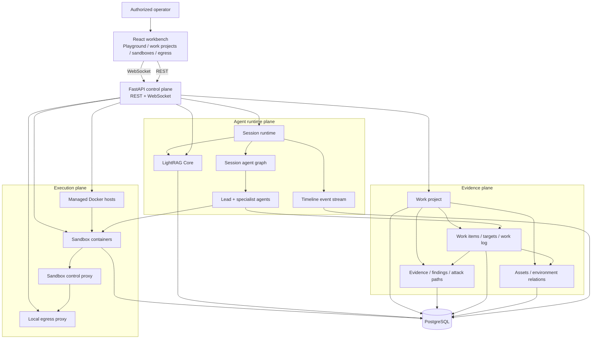
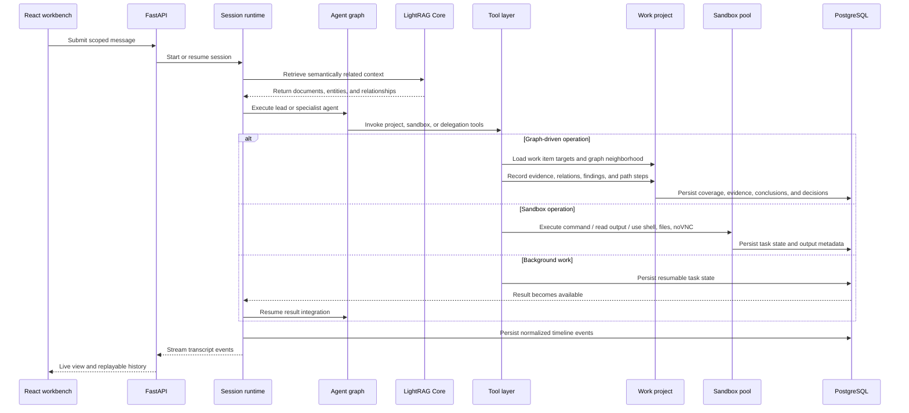
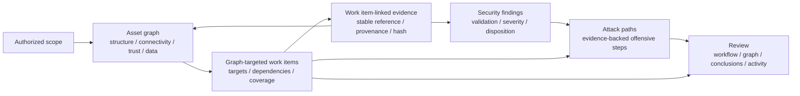
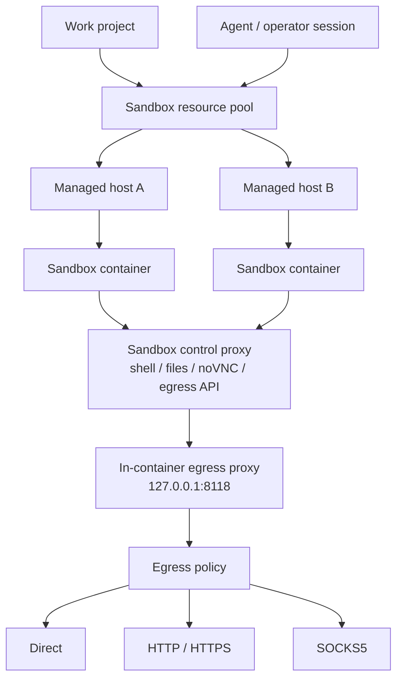

<p align="center">
  
</p>

<p align="center">
  <strong>English</strong>
</p>

<p align="center">
  <a href="#architecture">Architecture</a> ·
  <a href="#runtime-flow">Runtime flow</a> ·
  <a href="#evidence-model">Evidence model</a> ·
  <a href="#sandbox-and-egress">Sandbox and egress</a> ·
  <a href="https://yv1ing.github.io/Z3r0/en/">Documentation</a> ·
  <a href="https://yv1ing.github.io/Z3r0/en/guide/quick-start">Quick start</a>
</p>

<p align="center">
  <strong>AI-native red-team workbench for authorized penetration testing and vulnerability research, with specialist agents, sandboxed tooling, evidence records, and replayable timelines.</strong>
</p>

---

> :warning: **Security notice**
>
> This project is intended only for security testing, risk assessment, and academic research within legal and explicitly authorized scopes. It must not be used for unlawful, unauthorized, or destructive purposes.
>
> This project does not grant permission to test, access, scan, or affect any third-party systems, networks, services, accounts, or data.
>
> **The author is not responsible for any consequences, losses, damages, legal liabilities, or unlawful behavior caused by users.**

## Overview

Z3r0 is an AI-native red-team workbench for authorized penetration testing and vulnerability research, with specialist agents, sandboxed tooling, evidence records, and replayable timelines. It combines a React operator console, a FastAPI management plane, a session-based multi-agent runtime, project-scoped evidence records, distributed Docker sandbox resources, and a controlled egress layer.

Z3r0 brings authorized scope, asset relationships, specialist assignments, evidence, findings, attack paths, workflow decisions, sandbox resources, and session timelines into one shared workspace. Red teams can coordinate execution, follow assessment progress, trace conclusions to supporting material, and review the complete operation without reconstructing state from separate conversations and tools.

## Architecture



Z3r0 separates the system into four architectural planes:

| Plane | Scope |
| --- | --- |
| Control plane | Users, system configuration, agents, sessions, work projects, knowledge collections, managed hosts, sandbox images, sandbox containers, and egress proxies. |
| Runtime plane | Multi-agent session execution, task-input LightRAG retrieval, live event streaming, long-running task continuity, history projection, and timeline replay. |
| Evidence plane | Authorized scope, asset relationships, graph-targeted work items, immutable evidence, findings, attack paths, target coverage, and workflow decisions. |
| Execution plane | Docker hosts, sandbox containers, shell/file/noVNC access, command execution, sandbox-local skills, built-in security tooling, and outbound network policy. |

This separation is reflected in the repository structure: routers and handlers expose application contracts, services own domain behavior, models define persistent state, and the React workbench consumes the stable REST/WebSocket surface.

## Runtime flow




## Evidence model



Work projects provide a durable workspace for each assessment. Operators can explore the target environment as an asset graph, assign specialists to specific assets and test surfaces, review the evidence produced by each assignment, and follow validated offensive progression through attack paths. Findings and path conclusions remain connected to their supporting material, giving the team a coherent record from initial scope through review and retesting.

| Data object | Role in the assessment |
| --- | --- |
| Work project | Assessment boundary for owners, authorized scope, sandbox bindings, sessions, workflow, and closure. |
| Asset | Canonically identified network, host, domain, service, application, endpoint, code, artifact, identity, data, or cloud entity. |
| Relation | Evidence-matured environment assertion covering structure, connectivity, dependencies, identity, trust, data flow, or provenance. |
| Work item | Coordinated action unit connecting an assigned specialist with graph targets, dependencies, test surfaces, completion criteria, evidence, coverage conclusions, and lead review. |
| Evidence | Immutable work item-attributed observation with provenance, a stable source reference, supersession, and guarded invalidation. |
| Finding | Evidence-backed security conclusion with validation, impact, disposition, and severity kept consistent with optional CVSS scoring. |
| Attack path | Continuous sequence of offensive actions from entry to target, with evidence and optional ATT&CK mapping per step. |

The workbench gives operators a unified view of scope coverage, current assignments, blocked test surfaces, review queues, validated findings, attack paths, evidence, and specialist activity. Leads can review completed work, return specific target surfaces for further validation, and use focused search and filters to move quickly from project-level posture to the relevant asset, assignment, evidence chain, or security conclusion.

## Sandbox and egress



Sandbox resources are managed infrastructure. Administrators manage Docker hosts, sandbox images, running containers, exposed ports, and project bindings. Operators and agents work through selected running containers, and the same sandbox boundary supports command execution, shell sessions, file management, browser/noVNC review, and sandbox-local skills.

The default sandbox image provides a focused security workspace with targeted DNS and ownership checks (`dnsx`, `dig`, `nslookup`, `whois`), low-volume HTTP inspection (`curl`, `wget`, `httpx`, `openssl`), focused service diagnostics (`nc`, `nmap`), local file and archive triage (`file`, `sha256sum`, `7z`, `unzip`, `tar`, `readelf`), Android and firmware analysis (`jadx`, `apktool`, Ghidra, `binwalk`), binary and pwn tooling (`gdb`, Pwndbg, `strace`, `ltrace`, `pwntools`, and the `pwntools`-provided `checksec`), browser automation through `agent-browser-cli`, and Python workflows through `uv`.

Outbound traffic is normalized through a container-level egress profile. The sandbox runtime exports proxy environment variables to a local proxy inside the container; the control plane can update the upstream policy to direct access or a managed HTTP, HTTPS, or SOCKS5 proxy. This gives the platform a unified place to manage network identity, traffic routing, and operator-environment isolation.

## Technical highlights

| Highlight | Description |
| --- | --- |
| Multi-agent orchestration | A lead agent coordinates specialist agents for intelligence gathering, validation, code audit, reverse analysis, and cryptanalysis. |
| Graph-driven operations | Work projects bind specialist work items to in-scope assets, test surfaces, evidence, findings, and attack-path validation. |
| Retrieval context plane | Building knowledge graphs with LightRAG Core provides matching original document chunks and graph context for task-oriented inputs. |
| Replayable event timeline | The UI consumes normalized timeline events that can be streamed live or loaded later as history. |
| Distributed sandbox resources | Managed Docker hosts, images, and containers allow execution environments to be isolated, scaled, and assigned to projects. |
| Preloaded sandbox toolchain | The default image provides targeted DNS, HTTP, and service diagnostics plus local artifact, Android, firmware, reverse engineering, browser, and Python capabilities behind sandbox-local skills. |
| Unified egress layer | Container traffic can be routed through direct, HTTP, HTTPS, or SOCKS5 modes using one platform-managed policy surface. |
| Operator workbench | The frontend combines chat, workflow state, graph review, evidence chains, attack paths, sandbox selector, terminal, files, and noVNC. |

## Expert team

| Code | Name | Role | Responsibilities |
| --- | --- | --- | --- |
| `cso` | Z3r0 | Chief security lead | Task decomposition, team coordination, result integration |
| `cae` | V3ra | Code audit engineer | Source code auditing, dependency review, remediation verification |
| `cie` | L1ly | Intelligence gathering engineer | Intelligence gathering, asset discovery, relationship mapping |
| `cpe` | Fr4nk | Penetration testing engineer | Penetration testing, vulnerability validation, impact confirmation |
| `cre` | J4m3 | Reverse analysis engineer | Reverse analysis, firmware disassembly, binary unpacking |
| `cce` | Nu1L | Cryptography engineer | Cryptographic analysis, key review, security assessment |

## Repository layout

```text
core/        Agent specifications, runtime, task runtime, delegation, context, tools
service/     Domain services for agents, knowledge, sandbox, users, hosts, egress, and projects
router/      FastAPI route declarations
handler/     HTTP and WebSocket request handling
model/       SQLModel database models
schema/      Pydantic API contracts
web/         React workbench and landing page
sandbox/     Docker sandbox image and control proxy
docs/        VitePress documentation
.z3r0/       Runtime configuration, agent prompts, logs
.lightrag/   Temporary LightRAG parser inputs and local working files
```

## Documentation

- [Overview](https://yv1ing.github.io/Z3r0/en/guide/overview)
- [Quick start](https://yv1ing.github.io/Z3r0/en/guide/quick-start)
- [First use](https://yv1ing.github.io/Z3r0/en/guide/first-use)
- [Community](https://yv1ing.github.io/Z3r0/en/guide/community)

## Acknowledgments

Thanks to the [Linux.do](https://linux.do/) website and its community for their support in project development and communication.

## License

This project is licensed under the [MIT License](LICENSE).

## Star history

<a href="https://www.star-history.com/?repos=yv1ing%2FZ3r0&type=date&legend=top-left">
 <picture>
   <source media="(prefers-color-scheme: dark)" srcset="https://api.star-history.com/chart?repos=yv1ing/Z3r0&type=date&theme=dark&legend=top-left&sealed_token=RN0abSf855BePOEmL59e0_3n0YNDKD7dv3YlNcCsCAQv2bCz3UEFtxcnM6pt2l_7PDeTINHHEaGJtf3PMbTJSs2rGE7ruvJKT6s0tFpFz588h9_ZogUu4XPVByE_gHQOsVy1a5xePtlj3byoP9YmQaybaeuPDNU-jMZDLf_jgmr06wzD6VdL0zHD4HB7" />
   <source media="(prefers-color-scheme: light)" srcset="https://api.star-history.com/chart?repos=yv1ing/Z3r0&type=date&legend=top-left&sealed_token=RN0abSf855BePOEmL59e0_3n0YNDKD7dv3YlNcCsCAQv2bCz3UEFtxcnM6pt2l_7PDeTINHHEaGJtf3PMbTJSs2rGE7ruvJKT6s0tFpFz588h9_ZogUu4XPVByE_gHQOsVy1a5xePtlj3byoP9YmQaybaeuPDNU-jMZDLf_jgmr06wzD6VdL0zHD4HB7" />
 
 </picture>
</a>
